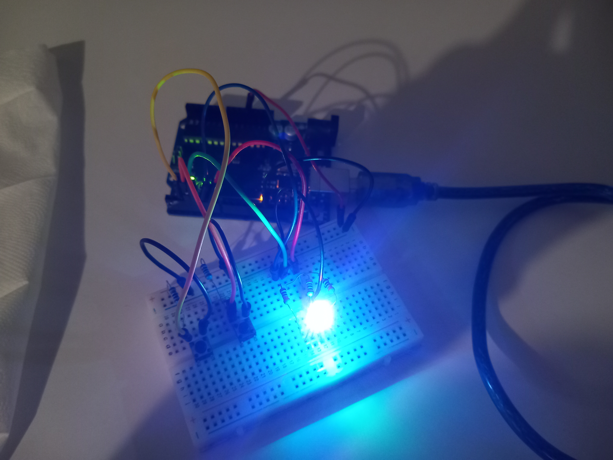
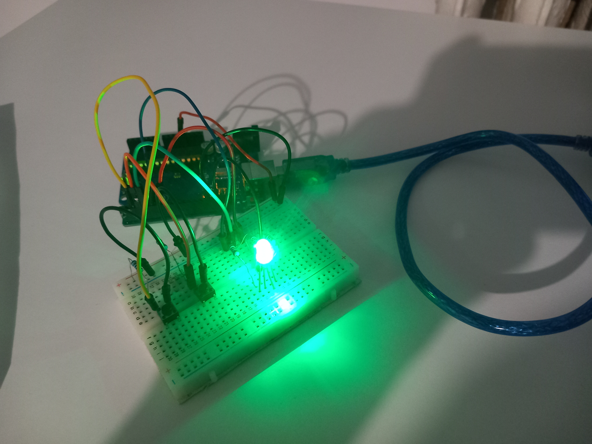
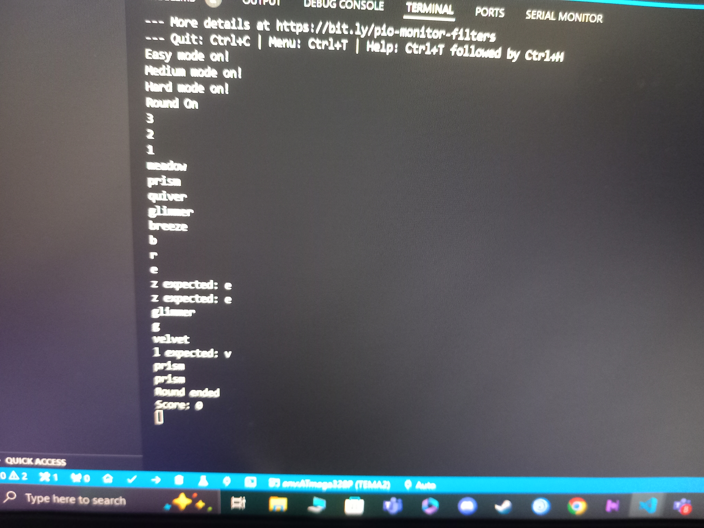
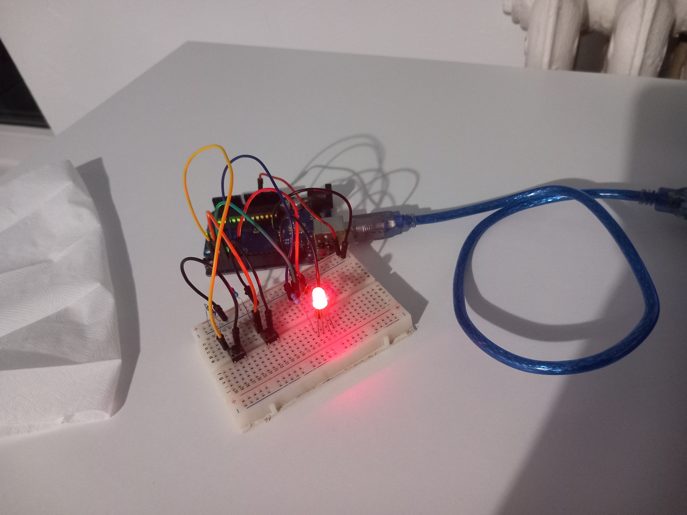

  # 1.TASK
   In aceasta tema am avut de creat un joc asemanotor cu TypeRacer folosind o placuta arduino uno, 2 butoane, un led RGB si portul serial. In afara unei runde de joc ledul este alb si jucatorul poate alege dificultatea (viteza cu care apar cuvintele) prin apasarea unui buton. O runda de joc incepe cand se apasa pe un al doilea buton disponibil, LED-ul va clipi de 3 ori in 3 secunde si va afisa in terminal o numaratoare inversa, dupa care butonul se face verde si incep sa apara cuvinte in terminal. Daca se introduce o litera gresita led-ul se face rosu pana cand greseala se corecteaza cu backspace. La sfarsitul rundei se va afisa numarul de cuvinte scrise corect in runda respectiva (o runda are un interval de timp de 30 de secunde). Daca butonul de pornire este apasat in timpul rundei de joc aceasta se va opri iar led-ul devine alb, incheind runda.
  # 2.COMPONENTE UTILIZATE
  * 1x rduino uno (ATmega328P)
  * 1x breadboard
  * 1x LED RGB 
  * 2x Butoane 
  * 9x Rezistoare (3x 330ohm, 2x 1Kohm)
  * Fire
  # 3.POZE
  
  
  
  
  
  # 4.VIDEO
  **[Link catre video tema](https://www.youtube.com/watch?v=-VH8JQKSR5E)**
  # 5.SCHEMA ELECTRICA
  
  
