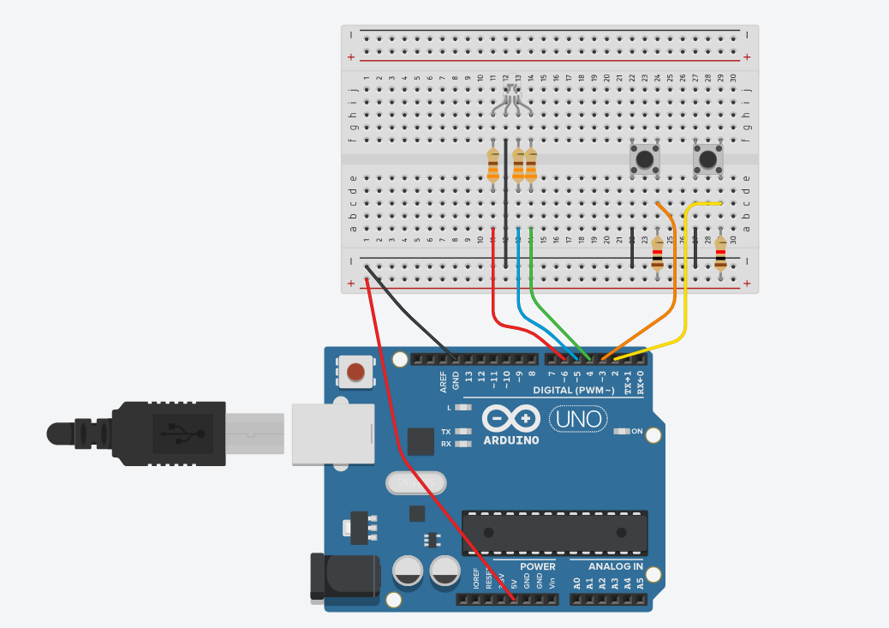
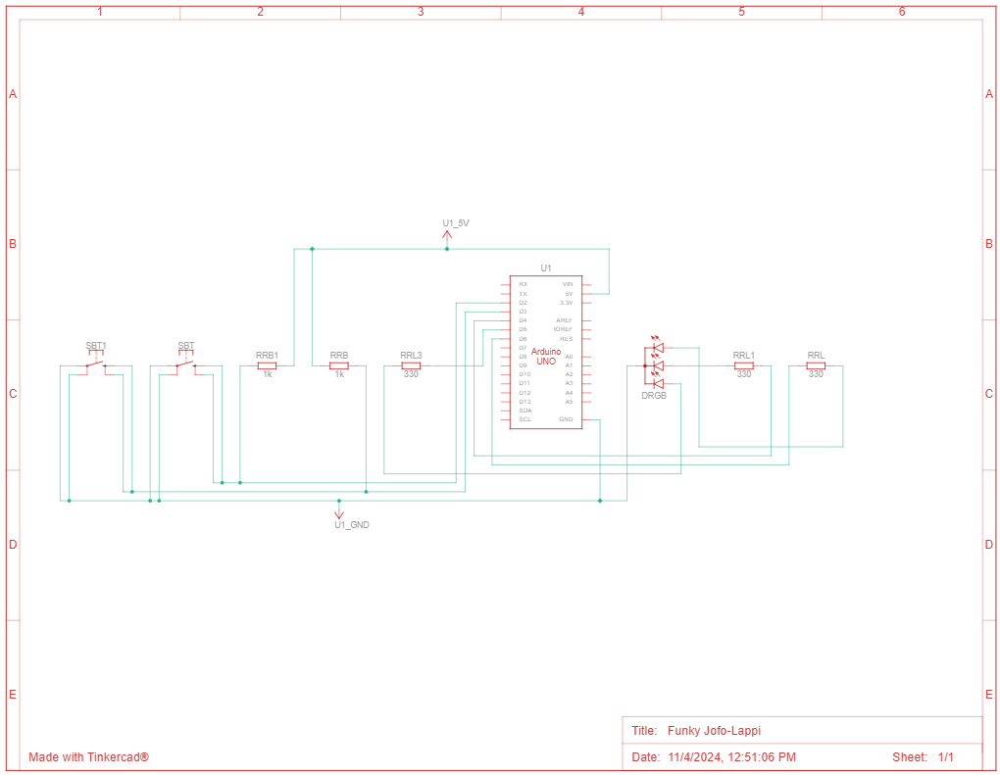

 # 1.TASK
  Pentru aceasta tema am avut de simulat o statie de incarcare pentru un vehicul electric, folosind leduri si butone. 
  Pentru aceasta tema am avut de: 
  
  1. Documnentat tema
  2. Utilizat componente fizice pentru a realiza circuitul electric
  3. Implementarea codului pentru a indeplini cerintele urmatoare:
  * Setarea Led-ului RGB verde cand statia este libera si rosu cand aceasta este utilizata
  * Led-urile simple care reprezinta procentajul de incarcare (L1 = 25%, L2 = 50%, L3 = 75%, L4 = 100%) sa se aprinda progresiv, incarcarea a 25% din capacitate luand 3 secunde pentru a se incarca. Led-urile care reprezinta procentajele atinse raman aprinse in timp ce urmatorun care urmeaza sa se atinga clipeste, iar restul raman stinse.
     Apasarea scurta a butonului de start cand e libera statia va porni incarcarea, in rest nu va face nimic
  * Apasarea lunga (minim o secunda) a butonului de off cand statia este utilizata va opri incarcare, in rest nu va face nimic
  * Atunci cand se opreste/termina incarcarea led-urile simple vor clipi de 3 ori pentru a semnala oprirea
  # 2.COMPONENTE UTILIZATE
  * 1x placuta arduino uno cu ATmega328P-PU
  * 1x breadboard
  * 4x LED-uri albastre
  * 1x LED RGB 
  * 2x Butoane 
  * 9x Rezistoare (3x 220ohm, 4x330ohm, 2x 1Kohm)
  * 14x Fire
  # 3.POZE
  # 4.VIDEO
  **[Link catre video tema](https://youtu.be)**
  # 5.SCHEMA ELECTRICA
  
  
